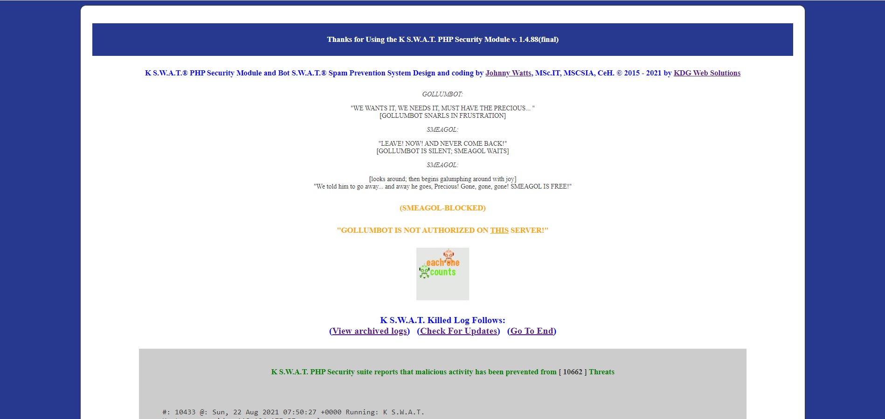

<h2>K S.W.A.T. PHP Security and Spam Prevention Suite</h2>

The K S.W.A.T. Security Suite not only blocks millions of known bad actors by IP Blacklisting, but also provides protection for PHP driven websites from some of the most common types of threats and attacks on the internet.

Some types of mitigated atacks and vulnerabilities are:

<ul>
	<li>SQL Injection</li>
	<li>Remote Code Execution</li>
	<li>Remote File Inclusion</li>
	<li>Cross Site Scripting</li>
	<li>POST/GET Data manipultion</li>
	<li>Directory Traversal</li>
	<li>WordPress User and Config Exploits</li>
	<li>Joomla User and Config Exploits</li>
	<li>See internal documentation for full list</li>
</ul>

This software is for use with PHP driven websites ONLY. 
